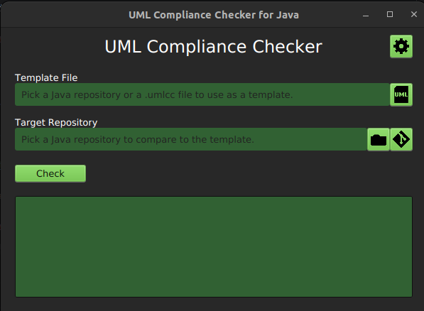
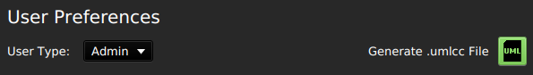
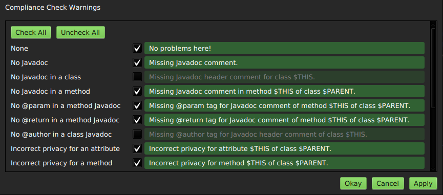

# UML Compliance Checker for Java
A mix of an autograder and a style guide, this program allows you to compare two Java Projects to see if one has the same classes, methods, and variables as the other (i.e. if they would have the same UML class diagram). Rather than testing output of a program, this allows graders to see if the internal structure of two projects are identical.

## Usage

`Template File / Repository`: The project to compare to (i.e. the "right answers").
- Users may select a `.umlcc` file, which contains all of the information that would be in a UML for a class.
- Admin users may select a project repository rather than a `.umlcc` to directly compare project repositories.
- A Template is not required. Users may check a project without comparing it to anything, which will check the non-comparison compliance such as Javadoc.

`Target Repository`: The project to check (i.e. the student's submission).

- Users may select a project repository on their device or clone a project from a remote Git repository.
- Users may change how projects are cloned to their device in the Settings menu.

After selecting your Target and potentially your Template, click `Check` to generate output in the text box below.

## .umlcc Files

A `.umlcc` file represents the structure of the UML diagram associated with a project. Admin users can generate `.umlcc` files in the Settings window. These files can safely be sent to students so they may check the compliance of their projects without seeing the source code.

Generated `.umlcc` files are stored in the `/umlcc` directory.

## Compliance Check Warning Configuration

You can customize the output of your compliance checks in the configuration settings by selecting which warnings to check for and setting their output messages.

### Swap Codes

When writing the output messages for a compliance check, you can use certain codes that will swap out for the names of the things you are checking.

|  Code | Definition                                                                                       |
|:---------:|:-------------------------------------------------------------------------------------------------|
|  `$THIS`  | the name of the class, method, or variable that is getting the warning.                          |
| `$OTHER`  | the name of the class, method, or variable that `$THIS` is comparing itself to.                  |
| `$PARENT` | the name of the class that `$THIS` is a member of. Only applicable to methods and variables. |

## Acknowledgements

This project was made under the guidance of instructor Portia Plante from the Molinaroli College of Engineering and Computing of the University of South Carolina and in association with the South Carolina Honors College. This project has been approved to fulfill the "Beyond the Classroom" Honors College requirement through SCHC 497 - Undergraduate Research.

